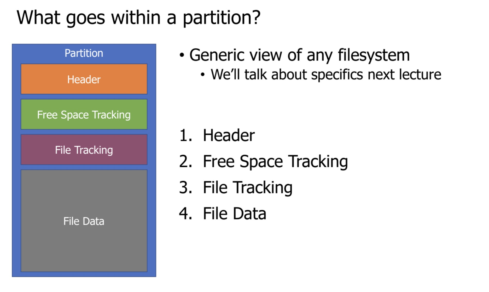

# File Systems

### How File Systems Are Stored On Disk?

We use disk partitions.

**A disk partition is a contiguous section of a physical disk that is formatted to store a file system.**

##### Header

Generic view of any filesystem

##### Free Space Tracking

Track which blocks in “File Data” are in use.

**How:**

We use **bitmap**:

1. **Representation:** Each data block on the disk is represented by a single bit.
2. **Mapping:** A bit is set to indicate whether the corresponding block is **free** (e.g., 1) or **used** (e.g., 0), or vice versa. Every block is listed in order.

##### File Tracking

**Allocation Table**

Manages file data as a **linked list** of clusters.

**Inode**

**Inode Table (or Inode Area):** This is a fixed-size region (in older/traditional filesystems) that contains an array of all the **inodes** for the file system. Each entry in this array is a single inode data structure, and its index in the array is its unique **inode number** (i-number).

Note: "update attributes" because we might need to update things like "last read time", etc.

Note:

1, "point to it in inode" because after we created new data block, we need to include it in the inode

2, difference between data bitmap and inode bitmap:

- **Data Bitmap (or Block Bitmap):** Tracks the usage of **data blocks**, which hold the actual *content* of files.15

- **Inode Bitmap:** Tracks the usage of **inodes**, which hold the *metadata* (like permissions, size, and block pointers) for files and directories.16 A bit in the Inode Bitmap is 171 if the inode structure is in use, and 180 if it's free to be allocated for a new file.

### File System Optimization

**Why we need file system caching?**

Cache popular blocks so the disk can be accessed less frequently.

##### Unified Page Cache

Page replacement policy will consider both pages from memory pages, which stores temporary data, and pages cached from disk.

**Priority for Eviction:**

1. **Unwritten disk files or unmodified anonymous memory pages:** These are the safest to evict because they do not require a write operation to disk or swap space before being freed.
2. **Written disk files:** These pages contain changes that will eventually need to be written to the disk anyway, making them a reasonable candidate for eviction.
3. **Modified memory pages:** These pages must be written to swap space so that the data can be retrieved later, making them the least desirable to evict immediately.

Note: swap space is an "intermediate stop" between disk and RAM.

##### Classical File Systems (FAT vs FFS)

**File Allocation Table**

Allocation table for tracking data blocks

Still in use for embedded systems

**Fast File System**

1. **The Problem FFS Solved**

The original Unix FileSystem (FS) from the 1970s was **simple and slow** (Page 18) because:

- **Inodes were far from data blocks:** This meant that reading a file often required the disk head to jump back and forth between the inode (which holds the file's metadata and pointers) and the actual data blocks, leading to high latency (seek time).

- **Data blocks became fragmented over time:** Fragmentation occurs when a file's data is scattered across the disk, further increasing the non-sequential head movement needed to read the file.
2. **FFS's Key Innovation: Cylinder Groups**

To achieve better sequential access, FFS introduced the concept of splitting the disk space into a set of **"cylinder groups"**.

- **Group Structure:** Each cylinder group is a smaller, contiguous area on the disk and contains its own copies of essential file system structures:
  
  - Superblock Information (SBI)
  - Bitmaps (for tracking free space)
  - Inodes
  - Data Blocks

- **Goal:** By keeping the related inodes and their data blocks close together within the same group, the FFS minimizes the disk seeking required when accessing a file.
  
  
3. **FFS File Placement Strategy**

The general theme of FFS is to **"put related pieces of data near each other"**.

FFS follows a set of rules for placing files on the disk:

1. **Directory Data near Directory Inodes:** The information describing the contents of a directory is stored near the directory's own inode.

2. **File Inodes near Directory Data:** The inodes for the files within a directory are placed close to the directory's data.

3. **Data Blocks near File Inodes:** The actual data of a file is placed close to its own inode.

4. **The Large File Problem**

FFS prioritizes **small files** because they are the most common. However, this creates a potential issue for very large files:

- **The Problem:** A single large file could fill up nearly an entire cylinder group, meaning any remaining files (even small ones) would have to be placed in other, distant groups.

- **The Solution:** FFS limits the maximum file size per group. If a file exceeds this limit, its remaining blocks are placed in other, less full cylinder groups. 
4. **FFS in the Modern Context**

While FFS was revolutionary for its time, the document notes that its ideals are **"no longer relevant"** for many modern systems (Page 23).

##### Improving Reliability

- **FSCK (File System Checker)**
  
  - Scans the entire disk after a crash to find and fix contradictions (e.g., consistency between data bitmaps and inodes).
  - **Problems:** Slow (especially for large disks) and makes disks *consistent*, not necessarily *correct* (it might "fix" things in a trivial or non-optimal way).

- **Journaling Filesystems**
  
  - **Goal:** Guaranteeing correctness through atomic transactions.
  - **Mechanism:**
    1. **Stage Changes in Log:** All transactions (writes) are first written to a reserved part of the disk called the "journal."
    2. **Commit:** A commit message is written to the log.
    3. **Permanent Changes:** The logged writes are then performed on disk.
    4. **Clear Log:** The journal is cleared after permanent changes are made.
  - **Resolving Crashes:**
    - **No transaction:** Journal is empty, do nothing.
    - **Crash before commit:** Data in journal, but no commit message. Clear the log (rollback).
    - **Crash after commit:** Journal has commit message. Replay the transaction from the beginning, then clear the journal.

##### Copy On Write

CoW is an approach to improving reliability and functionality in a filesystem.

- **Version Files:** CoW enables the ability to roll a file back to an older version from a prior point in time.

- **Correctness (Atomic Transactions):** It achieves crash recovery without needing a separate journaling mechanism.

**The Core Mechanism**

The key to Copy-On-Write is that **data is never overwritten in place**. Instead, when a write operation occurs, the file system performs a copy.

1. **Instead of overwriting an existing data block:** The update is written to a **brand new data block** (a different physical location on the disk).
2. **Update the Metadata:** A new inode (or equivalent metadata structure) is created for the file.
   - This new inode points to the **new data block** for the modified section.
   - It continues to point to the **original data blocks** for all the parts of the file that were *not* modified.
3. **Resulting Versions:**
   - The **new inode** points to the **new version** of the file.
   - The **old inode** remains unchanged and still points to the **old version** of the file.

