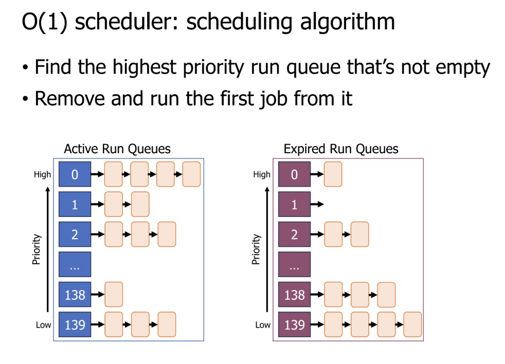

# Scheduling

## Context Switching

**Definition**:

The process of suspending the current process/kernel context and resuming another, including saving and restoring CPU state (registers, program counter, etc.)

High-level steps for switching to the process:

1. Scheduler decides which process should be running
2. Save kernel register values to kernel stack
3. Restore process register values
4. Switch to process mode instead of kernel mode
5. Jump to next instruction in process

High-level steps for switching to the kernel:

1. Process executes a system call
2. Processor enters kernel mode and runs an exception handler
3. Save process registers
4. Restore kernel registers
5. Figure out why a context switch occurred

## Batch Systems

**Definition:**

A system that processes a series of jobs sequentially without direct user intervention.

Example: payment system

**Metrics:**

*Throughput:* Jobs completed per unit time

*Turnaround time:* Duration from job arrival until job completion

**Schedulers for batch systems:**

1. FIFO Scheduling

2. Shortest Job First

3. Preemptive Shortest Remaining Processing Time
   
   • Schedule job with smallest duration first
   • Preempt a running job when new jobs arrive
   • Then schedule job with smallest **remaining duration**

## Interactive Systems

**Definition:**

A system that processes a series of jobs sequentially with direct user intervention.

Differences from batch systems
    • Humans are “in-the-loop”
    • Many jobs have no predefined duration

**Metrics:**

*Response time:* Time from arrival until the job **begins** execution

**Schedulers for interactive systems:**

**1. Round Robin**

Runs a job for a small timeslice, then schedules the next job.

**Edge Case**: If a job completes before its timeslice expires, immediately schedule the next job with a fresh timeslice (no wasted time). For example, if the timeslice is 5 but a job completes at 2, the next job gets a full timeslice of 5.

**2. Multi-Level Feedback Queue**

**Rules:**

1. If J1 priority > J2 priority, runs J1
2. If J1 priority = J2 priority, run in Round Robin
3. Jobs start at top priority
4. When a job uses its time quota for a level, demote it one level
5. Every S seconds, reset priority of all jobs to top (prevents starvation)

### Batch vs Interactive Systems Comparison

| Aspect | Batch Systems | Interactive Systems |
|--------|---------------|-------------------|
| **User involvement** | Jobs run without user interaction | Users interact during execution |
| **Job duration** | Predefined | Often unknown |
| **Key metric** | Throughput (maximize jobs/time) | Response time (minimize wait before execution) |
| **Example schedulers** | FIFO, SJF, SRPT | Round Robin, MLFQ |

## Real Time Operating Systems

The primary goal is to:

- Meet deadlines, even if the system is slow.

- Limit how bad the worst-case scenario is, often done mathematically.

- Prioritize predictability, as it is key to providing a performance guarantee.

### Earliest Deadline First Scheduling

Definition: highest priority given to task with soonest deadline

### Rate Monotonic Scheduling

Definition:

Assign fixed priority of **1/Period** for each job
• Makes the scheduling algorithm simple and stable
• Deterministic failures: only lowest priority jobs might miss deadlines

*Example:*

• *Job A: period 3, computation 1 -> Priority 1/3*
• *Job B: period 5, computation 2 -> Priority 1/5*

Job A runs first.

### Priority Inversion

**Problem**: A low-priority task holding a resource (lock) can block a high-priority task waiting for that resource, causing the high-priority task to miss its deadline.

**Solution** (Priority Inheritance): Temporarily increase the priority of the low-priority task to match the high-priority task waiting on it. This allows the low-priority task to finish and release the resource quickly, unblocking the high-priority task.

## Modern Operating Systems

Modern operating systems must balance fairness, responsiveness, and priority while managing thousands of concurrent jobs efficiently.

### Linux O(1) Scheduler

### Lottery and Stride Scheduling

- **Lottery Scheduling**: Jobs are given "tickets" based on the proportion of CPU time they should receive. Every time quantum, one ticket is drawn at random, and the corresponding job is scheduled to run. This method is probabilistic and therefore not suitable for real-time systems.

- **Stride Scheduling**: This removes the random element of lottery scheduling.
  
  - Each job is assigned a **stride number** inversely proportional to its priority (e.g., higher priority means a lower stride number).
  
  - The scheduler picks the job with the **lowest cumulative strides** (also called **Pass**) to run.
  
  - After running, the job's cumulative strides are incremented by its stride number.
  
  - This ensures that low-stride (high-ticket/priority) jobs run more often, and starvation is no longer possible.

### Linux Completely Fair Scheduler

- **Mechanism**: The scheduler tracks the processor time (referred to as **virtual runtime**) given to each job so far.

- **Scheduling Decision**: It chooses the thread with the **minimum virtual runtime** to schedule. This "repairs" the illusion of fairness.

- **Priorities and Virtual Runtime**: Priorities are applied through the virtual runtime.
  
  - High-priority jobs have their real runtime converted to a *smaller* virtual runtime (e.g., 1 second real-time = 0.5 seconds virtual-time).
  
  - Low-priority jobs have their real runtime converted to a *larger* virtual runtime (e.g., 1 second real-time = 2 seconds virtual-time).
  
  - Since the scheduler always picks the job with the *minimum* virtual runtime, high-priority jobs effectively get to run more often before their virtual runtime catches up.

- **I/O Blocking**: Jobs that block on I/O maintain a small processor time, helping their priority.
