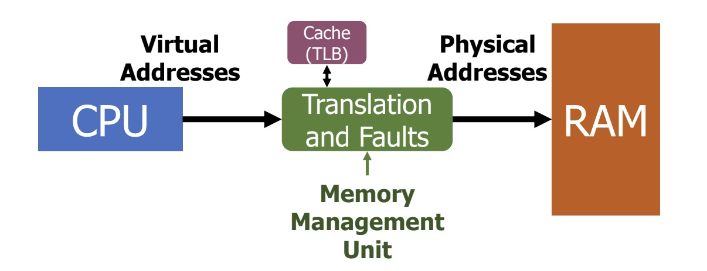
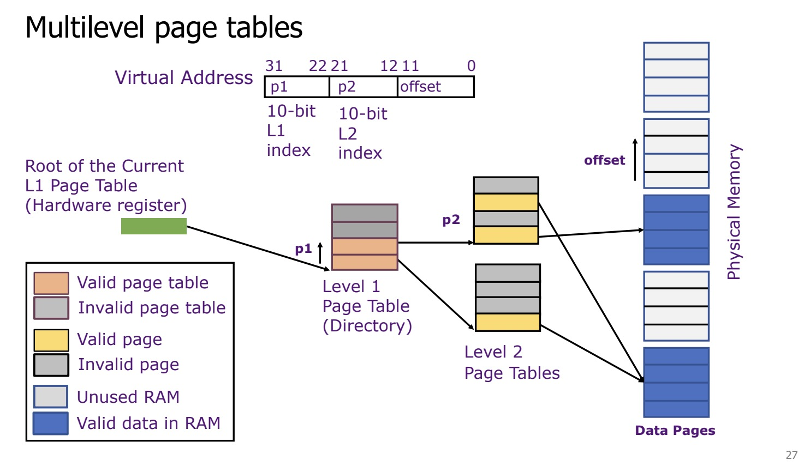

# Virtual Memory

### Segmentation

**Instructions:**

**Virtual Address: `0x1234`**

1. **Convert to Binary:** `0x1234` = `0001 0010 0011 0100`

2. **Identify Segment & Offset:**
   
   - **Segment Identifier (Top 2 bits in this case):** `00`
   
   - **Offset (Remaining 14 bits):** `01 0010 0011 0100` (which is `0x0234`)

3. **Find Segment Info:** The hardware looks at **entry 0** in the Segment Table (because the identifier was `00`). Let's say the table has:
   
   - **Segment 0:** Base = `0x4000`, Limit = `0x1000`

4. **Check Bounds:**
   
   - The hardware checks if the Offset (`0x0234`) is less than the Limit (`0x1000`).
   
   - `0x0234 < 0x1000`. The check passes.

5. **Calculate Physical Address:**
   
   - Physical Address = Base + Offset
   
   - Physical Address = `0x4000` + `0x0234` = `0x4234`

### Paging

The hardware (Memory Management Unit, or MMU) splits every virtual address into two parts:

1. **Page Number (p):** The "topmost bits" of the address. This part is used as an **index** to look up an entry in the Page Table.

2. **Page Offset (d):** The "bottommost bits" of the address. This part represents the exact byte *within* the page.

Here is the translation:

1. **Split:** The CPU generates a virtual address. The MMU splits it into its **page number (p)** and **offset (d)**.

2. **Lookup:** The MMU uses the **page number (p)** as an index into the process's **Page Table** to find the corresponding Page Table Entry (PTE).

3. **Find Frame:** The MMU extracts the **Frame Number (f)** from that Page Table Entry. This frame number is the starting address of the corresponding physical frame in RAM.

4. **Concatenate:** The MMU **replaces** the virtual page number (p) with the physical frame number (f) and **keeps the original offset (d)**.

**Example: CPU reads Virtual Address `0x3004`**

1. **Split the Virtual Address:**
   - Virtual Address (16-bit): `0x3004` (Binary: `0011 0000 0000 0100`)
   - **Virtual Page Number (VPN):** The top 4 bits: `0011` (or `0x3`)
   - **Offset:** The bottom 12 bits: `0000 0000 0100` (or `0x004`)
2. **Page Table Lookup (Hardware Step 1):**
   - The Memory Management Unit (MMU) uses the **VPN (0x3)** to index into the process's **Page Table**.
   - Let's assume the Page Table Entry for VPN `0x3` has the following content:
     - **PPN:** `0x7` (This PPN maps to a physical page in RAM)
     - **Valid Bit:** `1` (The page is currently in RAM)
     - **Access Rights:** `Read/Write`
3. **Check Valid and Access Rights (Hardware Step 2):**
   - The MMU checks the **Valid** bit (it's `1`, so it's in RAM).
   - The MMU checks the **Access Rights** (the CPU is performing a read, and it has `Read` permission).
   - *If the page were not valid, a page fault would occur, and the OS would be involved to load the page from disk.*
   - *If the access rights were violated, an access fault would occur, and the OS would be involved.*
4. **Combine PPN and Offset (Hardware Step 3):**
   - The MMU takes the **PPN (0x7)** and the **Offset (0x004)** and concatenates them to form the Physical Address.
   - PPN (`0x7`) + Offset (`0x004`) -> Physical Address `0x7004`.
     - *Note: In the document's example on page 50, Virtual Address `0x3004` is translated to Physical Address `0x7000` or `0x7004` depending on the array index, illustrating the mapping.*
5. **Access Memory (Hardware Step 4):**
   - The MMU uses the newly calculated **Physical Address (`0x7004`)** to access the RAM location.

### Why Modern OS Prefers Paging Than Segmentation

Irregularly-sized segments caused **fragmentation** and wasted memory space, which paging completely solves.

**Example:**

Imagine we have a small chunk of physical memory (RAM) that is **64 KB** in total.

We are going to load and remove processes in this order:

1. **Load Program A** (Requires 16 KB)

2. **Load Program B** (Requires 16 KB)

3. **Load Program C** (Requires 16 KB)

4. **Kill Program B** (Frees 16 KB)

5. **Try to Load Program D** (Requires 24 KB)

---

##### Case 1: Segmentation (Variable Sizes)

In segmentation, we allocate exactly the amount of continuous space a program needs.

1. **Load A, B, C:** The memory fills up nicely.
   
   - `[Program A (16KB)] [Program B (16KB)] [Program C (16KB)] [Empty (16KB)]`
   
   - *Total Used:* 48 KB. *Total Free:* 16 KB.

2. **Kill Program B:** We remove B, leaving a "hole" in the middle.
   
   - `[Program A (16KB)] [ HOLE (16KB) ] [Program C (16KB)] [Empty (16KB)]`
   
   - *Total Free Memory:* 32 KB (16KB hole + 16KB at the end).

3. **Try to Load Program D (24 KB):**
   
   - Program D needs a **continuous** block of 24 KB.
   
   - We look at the first free spot (the Hole): It is only 16 KB. **Too small.**
   
   - We look at the last free spot (the End): It is only 16 KB. **Too small.**

**The Result (External Fragmentation):** Even though we have **32 KB** of total free memory, we cannot load a **24 KB** program because the free memory is fragmented into non-continuous chunks. We are stuck unless we pause everything and defragment (compact) the memory, which is very slow.

---

##### Case 2: Paging (Fixed Sizes)

In paging, we divide memory into fixed blocks. Let's say the **Page Size is 4 KB**.

- Physical Memory is divided into 16 frames (64KB / 4KB).

- Program D (24 KB) requires **6 pages**.
1. **Load A, B, C:**
   
   - Program A takes Frames 0-3.
   
   - Program B takes Frames 4-7.
   
   - Program C takes Frames 8-11.
   
   - Frames 12-15 are empty.

2. **Kill Program B:** We free up Frames 4-7.
   
   - The memory now looks like this:
   
   - `[AAAA] [FFFF] [CCCC] [FFFF]` (where F = Free frame)
   
   - We have 8 free frames total (4 from B, 4 at the end).

3. **Try to Load Program D (24 KB):**
   
   - Program D needs **6 pages** total.
   
   - The CPU doesn't care if the pages are next to each other physically.
   
   - We place the first 4 pages of Program D into the spot where B was (Frames 4-7).
   
   - We place the remaining 2 pages of Program D into the end (Frames 12-13).

**The Result (No External Fragmentation):** We successfully loaded Program D! In paging, **if you have enough total free memory, you can always load the program.** The "holes" don't matter because the hardware can jump between any two frames instantly using the Page Table.

### Virtual Memory Optimization

##### Improving Translation Speed

We need to cache **page table entries**.

The hardware uses a small, very fast cache inside the Memory Management Unit (MMU) called the **Translation Lookaside Buffer (TLB)**

##### Reducing the Amount of Physical Memory Required to Store the Page Tables

We use multilevel page tables.

### OS Paging Implementation

The OS uses a higher-level abstraction called a **region**. A region is just a contiguous chunk of virtual memory, like the code section, stack section, or heap section. The OS keeps a list of these regions for each process.

**Key Feature 1: Lazy Loading**

When you start a program, the OS doesn't need to load the entire executable file from disk into RAM. That would be slow, and the program might not even use all its code.

Instead, the OS does **lazy loading**:

1. It creates a region for the code but doesn't actually load anything. It marks all the pages as "not present" in the page table.

2. When the process tries to execute an instruction, it accesses a "not present" page, which triggers a **page fault**.

3. The OS fault handler wakes up, sees the access is to a valid region, finds the right page in the executable file on disk, **loads it into RAM**, updates the page table to "present," and then resumes the process.

This "demand paging" means pages are only loaded from disk when they are first needed.

**Key Feature 2: Copy-on-Write (CoW)**

When a process calls `fork()`, the OS must create a near-identical copy of it. Copying all of the parent's memory would be very slow and wasteful, especially since the child process often just calls `exec()` immediately (loading a new program).

Instead, the OS uses **Copy-on-Write (CoW)**:

1. **Share Pages:** The OS *doesn't* copy any pages. It just lets the child process's page table point to the *same physical pages* as the parent.

2. **Mark Read-Only:** It then marks these shared pages as **read-only** in *both* the parent's and child's page tables.

3. **Fault on Write:** If either process tries to *write* to one of these pages, the "read-only" status triggers a page fault.

4. **Copy on Write:** The OS fault handler wakes up, **allocates a new physical page**, copies the data from the shared page into it, updates the writing process's page table to point to the new page, and marks *both* pages as writeable. The process then resumes.

This way, pages are only copied if and when they are actually written to.

### OS Paging Implementation

A **Region** is a data structure used by the OS to manage a process's virtual memory space (address space).

A region is just a contiguous chunk of virtual memory. The OS keeps a list of these regions for each process.

**Summary of Relationship**

The process is:

1. **Address Space** (The full range of virtual addresses).

2. **Regions** (Logical, contiguous blocks *within* the address space defined by the OS for code, data, stack, etc.).

3. **Pages** (Fixed-size subdivisions of the regions).

##### What Does Region Keep Track of

- **Starting Page/Address and Size:** Defines the location and extent of the region in virtual memory.
- **Protection Fields:** Permissions for the memory (e.g., read-only, read-and-write).
- **Bookkeeping Information:**
  - Is it a **kernel region** or an **application region**?
  - Is it a **"pinned" region** (one the OS should never remove)?
  - Is the region currently in **RAM** or on **disk**?
  - Has the region been **modified** (dirty)?
- **Mapping Source:** Where the memory comes from:
  - A **duplicate** of somewhere else in RAM (for shared memory).
  - **Fresh, zeroed-out memory** (Anonymous Mapping, used for the stack and heap).
  - A **copy of a file from disk** (File-backed Mapping, used for program code).

##### Operations of Region

| Operation   | Description                                                                                                                                           |
| ----------- | ----------------------------------------------------------------------------------------------------------------------------------------------------- |
| **Add**     | Creates a new region in the address space. Accesses to virtual addresses in this range should now succeed.                                            |
| **Remove**  | Removes the region entirely from the address space. Accesses to virtual addresses in this range should now cause a fault (like a Segmentation Fault). |
| **Move**    | Changes the physical addresses associated with the region.                                                                                            |
| **Protect** | Changes the protection status of the region (e.g., from read-only to read-and-write).                                                                 |

##### Lazy vs. Eager Region Allocation

When a new region is added, the OS has a choice about when to allocate the physical memory and update the page table:

- **Lazy Region (Lazy Allocation):** The new region is added to the OS data structure immediately, but the physical memory and page table updates are delayed until the memory is **first actually needed** by the process.
  
  This is detected when the process attempts to access an address within the region, which causes a **Page Fault** because the page table entry is marked as "not present".

- **Eager Region:** Everything is done immediately: the region is added to the data structure, memory is loaded into RAM, and the Page Table is updated.

### Swapping

Swapping is a mechanism where the Operating System moves some pages of a process from **Physical Memory (RAM) to Disk**. It allows processes to continue running even when not all of their pages are in physical memory.

##### How Swapping Works

**Location of Pages:**

Each page in a virtual address space lives in one of three locations:

1. **Physical Memory (RAM)**
2. **Disk (Swap Space)**
3. **Nowhere** (the page doesn't exist/is invalid)

**Page Table Entries (PTEs):**

The **Present bit** in the Page Table Entry is used to track the page's location:

- **Page in memory:** The Present bit is **set** (1).
- **Page on disk (swapped out) or never loaded:** The Present bit is **not set** (0). The PTE points to the block on the disk instead.
- **Invalid Page:** The Present bit is **not set** (0), and an invalid block number is indicated. This faults the process.

**Memory Access with Swapping (The Page Fault):**

When the hardware walks the page tables and finds the page is valid but **Not Present** (bit=0), it causes a **Page Fault** (specifically, a major/hard fault):

1. **Trap into OS** (Page Fault).
2. **If memory is full, select a victim page** in memory to replace.
   - If the victim page is **modified (dirty)**, the OS must write it to disk.
   - The TLB entry for the victim page is invalidated.
3. **OS reads the referenced page from disk into memory**.
4. **Page table is updated**, and the Present bit is set.
5. **Process execution resumes**.

**Modified Pages (Dirty Bit):**

Only **modified** pages need to be saved to the disk if they are swapped out.

##### Swapping Policies

The OS has policies to determine: 1) When to bring a page in (Selection) and 2) When to swap a page out (Replacement).

<u>A. Page Selection (When to Load Pages)</u>

- **Demand Paging (Lazy):** Load a page only when a page fault occurs (when it absolutely must be in memory).
- **Pre-paging (Prefetching):** Load a page before it is referenced (OS predicts future accesses).

<u>B. Page Replacement (Which Page to Evict)</u>

The goal is to minimize **hard page faults**.

- **Optimal Policy (Theoretical):** Evict the page that will be accessed furthest in the future. This is the theoretical upper bound on performance but is impossible to implement without predicting the future.
- **First-In-First-Out (FIFO):** Evict the page that has been in memory the longest.
  - *Disadvantage:* Pages that are always needed (like the stack) can be evicted.
- **Least Recently Used (LRU):** Replace the page that has **not been accessed for the longest time**.
  - *Advantage:* With locality, LRU approximates Optimal performance.
  - *Disadvantage:* Hard to implement perfectly as it requires tracking the access time for every page.

<u>C. Implementing LRU (Clock Algorithm)</u>

Because perfect LRU is complex and slow, modern systems use approximations, such as the **Clock Algorithm**:

- **Goal:** Find an old page, not necessarily the absolute oldest.
- **Mechanism:**
  1. A single **Accessed bit** is added to each page table entry (set by hardware upon reference).
  2. When a swap is needed, a "clock hand" cycles through the physical pages.
  3. The algorithm looks for a page with the Accessed bit **zero (0)** (not recently used).
  4. If the bit is **one (1)**, the algorithm clears the bit to zero and moves to the next page.
  5. The first page found with the Accessed bit already **zero (0)** is the victim and is swapped out.
  6. The "hand" continues from where it left off on the next cycle.

**Thrashing:**

**Thrashing** occurs when swapping happens frequently, causing the system to constantly wait on disk I/O and slowing the computer to a crawl.
