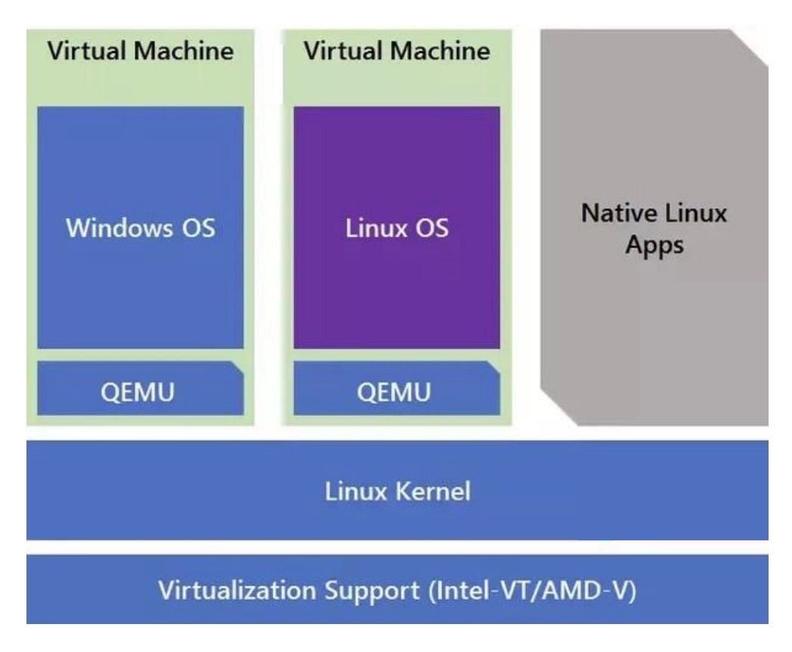
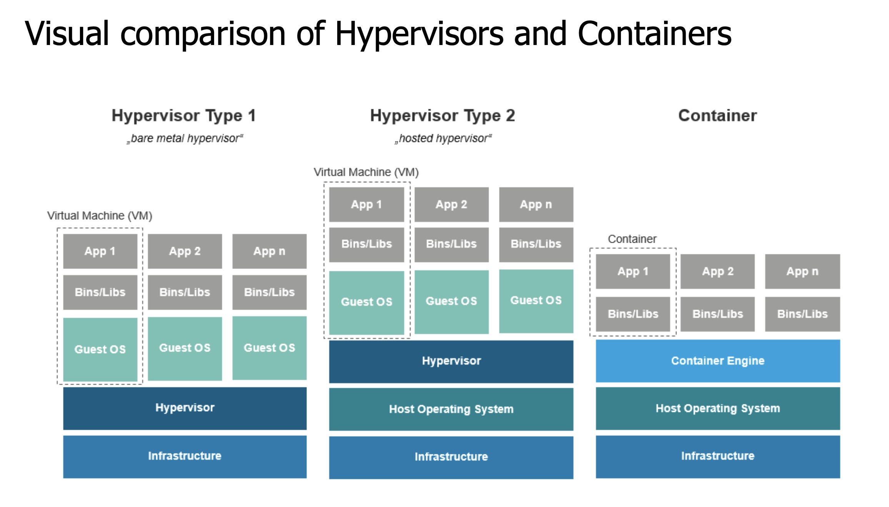

# Virtualization

## Virtual Machine

A **Virtual Machine (VM)** is an emulated version of a physical computer.

## Emulation

An **emulator** is a piece of software or hardware that enables one computer system (the **host**) to imitate the functions of another computer system (the **guest**) so that the host can run the guest's software.

Real world analogy: an emulator is like a translator.

## Hypervisors

A **hypervisor** is a layer of software that creates and runs **virtual machines (VMs)** by abstracting a host machine's resources and allocating them to the guest operating systems.

### Hypervisor versus Emulator

**Emulator:** Translates all code that runs.

**Hypervisor:** Only involved in "tricky" operations:
- Normal application code runs right on the hardware
- Normal OS code also runs right on the hardware
- Privileged code traps into the hypervisor to handle it

## Container

The container engine provide each application with illusion of its own dedicated OS.

### Control Groups (cgroups)

**Control groups (cgroups)** are a Linux kernel feature that limits and isolates the resource usage of processes. They allow the container engine to enforce resource constraints on containers without requiring a separate operating system kernel per container.

Key aspects of cgroups:

- **Resource Limiting:** Cgroups restrict how much CPU, memory, disk I/O, and network bandwidth a container can consume. This prevents one container from monopolizing system resources and starving other containers.

- **Hierarchical:** Cgroups are organized hierarchically, allowing fine-grained control over resource allocation across different levels of process groups.

- **Enforcement:** The Linux kernel enforces these limits at runtime. If a container tries to exceed its allocated resources, the kernel either throttles the process (for CPU) or terminates it (for memory).

- **Transparent to Applications:** Applications running inside a container don't need to be aware of cgroup limits; the kernel handles enforcement transparently.

Cgroups work alongside **namespaces** (which provide isolation of process IDs, network interfaces, filesystems, etc.) to create the complete container isolation model.

### Example: Docker

#### Core Concepts of Docker

**Images:** Describe the starting state of a Docker container, acting like a "snapshot" of the system with all dependencies, libraries, and application code.

**Union File System:** Docker images represent the filesystem as a sequence of layers. The final filesystem is a union of these layers, which can be reused across different images, reducing storage overhead and improving performance.

**Container Engine:** The software layer that manages the containers on top of the host operating system. It handles resource allocation, networking, and lifecycle management.

#### Docker Architecture and Implementation

Docker is implemented differently depending on the host operating system because it relies on the Linux kernel (specifically features like **cgroups** and **namespaces**) for resource isolation.

| Host OS | Implementation Method |
|---------|----------------------|
| Linux | Runs natively using the Linux kernel |
| Windows | Uses a virtual machine (typically WSL2) running Linux to host the containers |
| macOS | Starts a lightweight Linux VM to run the Docker engine and containers |

#### Question: Docker vs. Traditional Virtualization

**If Docker on Windows requires a virtual machine (VM) because Windows cannot natively run Linux containers without a Linux kernel, how is Docker "lighter" than traditional virtualization?**

**Answer:** Docker is still lighter than traditional virtualization on Windows because:

1. **Shared Kernel:** Even on Windows, Docker shares a single Linux kernel across all containers. Traditional VMs each run their own separate operating system kernel, multiplying the resource overhead.

2. **Minimal VM Overhead:** WSL2 (Windows Subsystem for Linux 2) is a lightweight virtual machine designed specifically to run a Linux kernel efficiently. It uses Hyper-V hypervisor but with minimal resource allocation compared to running full VMs.

3. **Container Efficiency:** Containers still leverage Linux namespaces and cgroups for isolation, which is much more efficient than emulating entire hardware and running separate OS instances. Containers share binaries and libraries, whereas VMs duplicate the entire OS.
